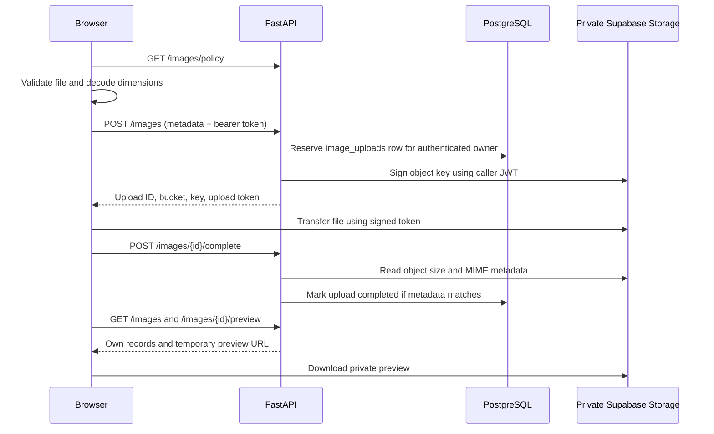

# Image upload pipeline (FR-32)

The `/upload-test` Next.js route is a test harness for a reusable image uploader.
It does not create a post. The first version accepts one JPEG, PNG, or WebP up
to **10 MB = 10,000,000 bytes**, and shows file size, pixel dimensions, reduced
ratio and a local preview. Unedited uploads preserve original bytes/aspect ratio.
The optional browser editor can crop and proportionally resize before submission.

## Data flow



The browser never queries application tables. Storage requests are the explicit
direct-transfer exception in AGENTS.md. Supabase Auth manages sessions; FastAPI
checks verified email and active account status for upload/complete (FR-02,
FR-96). Read routes check the active owner. FastAPI signs with the user's JWT
and the existing publishable key, allowing Storage RLS to enforce ownership.
There is no service-role key in either app.

## Modules

| Module | Responsibility |
|---|---|
| `frontend/src/lib/images/image-policy.ts` | Pure file limits, format signatures, byte and ratio formatting |
| `frontend/src/lib/images/image-file.ts` | Browser decode and object URL for preview |
| `frontend/src/lib/images/image-edit.ts` | Crop geometry, proportional sizing and canvas export |
| `frontend/src/components/ImageEditor.tsx` | Modal crop/resize session with Save and Discard |
| `frontend/src/lib/images/image-api.ts` | Reserve → transfer → complete; retry completion after an uncertain response |
| `frontend/src/components/ImageUploader.tsx` | Drop/browse/edit UI; standalone `onUploaded(SavedImage)` or `selectOnly` with `onSelected(SelectedImage \| null)` |
| `frontend/src/components/ImageUploadLab.tsx` | Account state, recent records and saved-file preview for testing |
| `backend/images.py` | Owner checks, reservations, completion and listing |
| `backend/image_storage.py` | Storage REST adapter; no image bytes pass through FastAPI |
| `backend/image_schemas.py` | Limits and upload API contracts |

## Schema and deployment

Migration `20260924191615_image_upload_pipeline.sql` introduces reusable uploads.
The later post-media migration integrates them with posts (see below). `public.image_uploads` holds:

- UUID, owner profile ID, bucket ID and unique generated object key;
- original file name, MIME type and byte size;
- browser-measured width and height (derive aspect ratio; do not store a duplicate);
- creation, completion and soft-deletion timestamps.

RLS is enabled. Owners can select their metadata; browser writes to the table
are denied. Storage INSERT requires a recent reservation for the same owner
and path. Storage SELECT permits owned records; the post-media migration also permits
objects attached to approved, nondeleted posts in active spaces. There is no public
bucket or object overwrite. A reservation is committed before
signing because Storage checks policies through a separate database connection.

The migration creates the `post-images` bucket with a 10,000,000-byte limit and
the three allowed MIME types. The global Storage upload limit must also allow
10 MB; a lower project-wide limit will still reject uploads. Keep the migration
constraints, bucket limits and `backend/image_schemas.py` in step when limits
change. The frontend fetches its policy from FastAPI.

Apply through the repository's normal migration workflow:

```sh
supabase db push --dry-run
supabase db push
```

The CLI must first be linked to the intended Supabase project using the README
setup. Both apps must point at that same project. No additional `.env` values
are required. The backend SQL connection needs privileges for `image_uploads`,
just as it already needs access to `profiles`.

## Rendering and browser editing

The preview uses intrinsic dimensions with `object-contain`, max width and max
height. It fits the entire image without stretching or discarding content.
Uploaded width/height can reserve layout space when integrated into a post.

**Edit image**, to the left of Submit, highlights after a valid selection. The
modal supports dragging a crop rectangle, editing its pixel coordinates, and
choosing full-image, square, 4:5 or 16:9 presets. Presets select centered regions;
subsequent dragging or coordinate changes allow a free ratio. Output width controls
proportional downscaling, capped at the crop size and a 4096-pixel maximum edge.

Save exports a new `File` through canvas and runs `inspectImage` again. The dialog
stays open if the export exceeds the file limit, allowing a smaller output size.
The preview, byte count and dimensions update only after successful validation.
Discard (or Escape) leaves the previous selection unchanged. Reopening edits the
current selection; choosing the source file again restores the original.

Saving edits does not transfer bytes. Submit uses the existing upload pipeline.
If the previous selection was already uploaded, the edited version receives a
new object key; existing uploaded objects are never overwritten. Editing also
clears any pending completion retry so it cannot submit stale metadata.

Canvas export creates a still image and does not preserve source animation or
embedded metadata. JPEG/WebP export uses quality 0.9; the actual exported MIME
type determines the extension if a browser falls back to PNG. Temporary object
URLs and canvas memory are released when replaced or no longer needed.

Feed-wide ratio rules remain a discussion: natural ratio preserves all content;
fixed thumbnail frames can use `object-cover` for a visual crop while a detail
view shows the whole image. Do not silently burn that rendering crop into uploads.

## Post integration and limits

`SavedImage.id` is the integration seam. The implemented `post_media` table
references completed uploads in display order and replaces `posts.image_key`.
The post-create transaction verifies ownership and completion, rejects duplicate
attachments, checks space bans (FR-95), and saves text, images or both. Existing
links remain readable. See [Posts and reusable images](posts-and-media.md) for
the module boundaries, schema, API, retries and tests agents should preserve.

An uploaded file is **not approved content** (FR-90). Upload previews are issued
only to the owner. Post previews additionally allow readers of approved posts.
Both return expiring bearer URLs valid for five minutes. Newly submitted posts
remain author-visible pending; classifier behavior remains deferred, including
[D-4].

This test pipeline is not a server-side image sanitizer. Browser signature and
decode checks provide feedback; Storage enforces byte count and declared MIME
type. Completion compares Storage's actual size/MIME metadata with the reservation.
Width/height and content type are not independently verified by decoding bytes
on a trusted worker. Add that validation/re-encoding stage before treating those
values as trusted content checks. Unedited uploads are not stripped or compressed;
optional browser editing re-encodes pixels but is not a trusted sanitization step.

Interrupted transfers or failed signing can leave unused reservations; transfers
whose confirmation fails can leave private objects. Retry confirmation uses the
same upload ID and is idempotent. Selecting the file again starts a new reservation.
Automated orphan cleanup and an end-user delete action are not implemented in this
first slice. Before broad use, add retention cleanup through Storage's delete API
(not SQL deletion of `storage.objects`); account-row deletion alone does not remove
object bytes. A signed upload capability can remain valid for two hours, so cleanup
must account for outstanding tokens before removing reservations/objects.

## Verification

```sh
cd backend
uv run python -m unittest discover -s tests -v
```

```sh
cd frontend
npm run lint
npx tsc --noEmit
npm test
npm run build
```

Backend tests mock Auth, Storage and the SQL session. They cover ownership,
verification, invalid/oversized inputs, object metadata mismatch, private preview,
retrying completion, and POST CORS. Frontend tests cover the byte boundary,
unsupported files, signatures and ratio calculations. Neither replaces a live
Storage/RLS smoke test after migration.

Manual checks with both apps running:

1. Open `/upload-test`; signed-out visitors can inspect a valid file but cannot submit.
2. Sign in as a verified student. Drop landscape, portrait and square images;
   confirm dimensions/ratio and the highlighted Submit image button.
3. Try an empty file, a renamed non-image, an unsupported format, multiple files,
   and a file above 10,000,000 bytes. Submission stays disabled with feedback.
4. Upload a valid image. Check the private saved preview, refresh, and click
   **View saved** to prove the metadata and bytes persisted.
5. Sign in as a different account: it must not list or preview the first account's
   image. A guessed upload UUID must return 404 from completion/preview routes.
6. Interrupt the completion request after transfer. **Retry confirmation** should
   complete the same upload, without transferring the image a second time.

Storage references:
[signed uploads](https://supabase.com/docs/reference/javascript/file-buckets-createsigneduploadurl),
[file limits](https://supabase.com/docs/guides/storage/uploads/file-limits),
[access control](https://supabase.com/docs/guides/storage/security/access-control).
