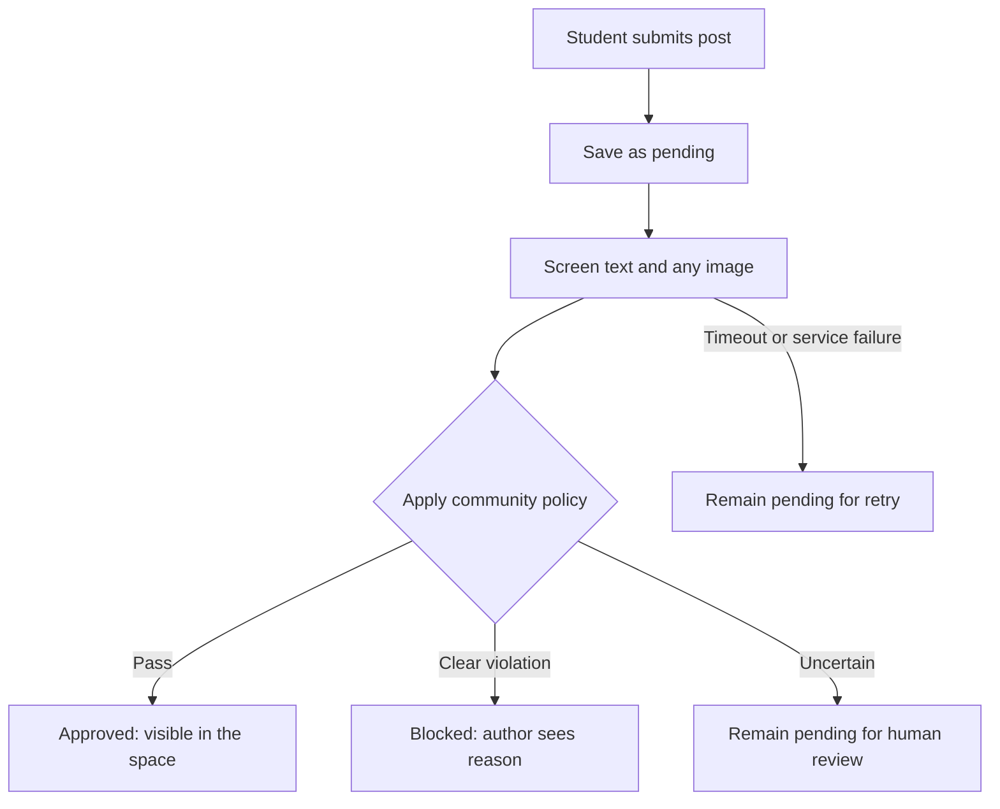

# Boko Lynx moderation

## Current implementation

`backend/moderation.py` calls the official OpenAI moderation endpoint with
`omni-moderation-latest`. It is an initial building block for FR-90–92, not a
publication pipeline. It runs without FastAPI or a database connection.

## Configure and run

Add your OpenAI API key to your existing, ignored `backend/.env`:

```dotenv
OPENAI_API_KEY=your_actual_api_key
```

Create/manage the key on the [OpenAI API platform](https://platform.openai.com/api-keys).
Keep it in the backend environment; do not put it in frontend code or commit it.
The module loads `backend/.env` explicitly and preserves existing environment
variables. The database password is unrelated to this credential.

From `backend`, using the project's existing environment:

```powershell
uv sync
uv run python moderation.py "Anyone studying at Alkek tonight?"
```

If `uv` is not on your PATH but dependencies are installed, on Windows use:

```powershell
.\.venv\Scripts\python.exe moderation.py "Anyone studying at Alkek tonight?"
```

This sends the supplied text to OpenAI. Output contains `flagged`, `categories`,
`category_scores`, the returned `model`, and measured `latency_ms`. Category
names such as `violence/graphic` are preserved. The command exits with status 1
on missing configuration, blank input, provider errors, or invalid responses.

## Use from backend code

```python
from moderation import moderate_text

result = moderate_text(f"{title}\n\n{body}")
```

This is a synchronous function, matching the current synchronous endpoints.
Do not call it directly on an async event loop without moving the work to a
thread or switching to an async client.

The implementation uses the official OpenAI Python SDK, installed with
`uv add openai`. This records the dependency in `backend/pyproject.toml`, locks resolved
versions in `backend/uv.lock`, and installs into `backend/.venv`. Teammates can
reproduce the environment with `uv sync`.

For this setup, `uv` was available at `.\.venv\Scripts\uv.exe`, so the command
run from `backend` was `.\.venv\Scripts\uv.exe add openai`. The executable path
selects which program runs; `uv` discovers the backend project and its virtual
environment from the working directory. Activation with
`.\.venv\Scripts\Activate.ps1` makes the environment's executables available on
PATH; it is optional when calling them by their explicit paths. Using `uv add`
also records dependency metadata so teammates can reproduce the installation.

One SDK request uses a 10-second network timeout with automatic retries disabled. This is
a starter transport setting, not the approximately 2-second publication wait
proposed in [D-4], and not a total job deadline. [D-4] remains unresolved.

`ModerationError` means screening failed, never that content is safe. The caller
must not substitute an unflagged result after an exception. Provider flags are
not final Boko Lynx publication decisions, nor a guarantee of profanity detection.

## Offline verification

From `backend`:

```powershell
uv run python -m unittest discover -s tests -v
```

Tests exercise the real SDK with a mocked HTTP transport, so they require no key, database, or network. They
check provider results, blank input, missing keys, authentication/rate-limit
errors, timeouts, and invalid responses. They do not measure model accuracy.

## Remaining integration

### Troubleshooting HTTP 429

A live demo returned HTTP 429 with `Too Many Requests`, type
`invalid_request_error`, and no specific error code or Retry-After header.
That response does not establish whether a request limit or an account quota
caused the failure. Wait briefly before retrying, then check the API project's
model limits and organization usage. Only change billing if the platform or a
specific quota error indicates a billing issue. No classification is available
when the request fails (FR-90).

Reference: [OpenAI error codes](https://developers.openai.com/api/docs/guides/error-codes).

### Future work

Publication rules/thresholds, image screening, profanity rules, moderation audit
writes, revision checks, retries, and moderator review remain future work.
No endpoint or database migration is introduced by this starter.

Reference: [official OpenAI moderation documentation](https://developers.openai.com/api/docs/guides/moderation).

---

## Design suggestions and alternatives

> Saved from the moderation discussion on September 22, 2026. These are proposals, not approved product decisions or implemented features. Service details reflect the sources consulted for the original answer.

> OpenAI has been selected and the SDK starter is described above. The original provider comparison is retained for context; the remaining workflow and policy suggestions are still proposals.

**For Boko Lynx, I’d start with a hosted moderation model, a separate profanity check, and a small human-review workflow.** That gives you a feasible semester project while covering more than a list of banned words.

The part you build is substantial: deciding what is allowed, connecting the classifier, controlling publication, handling failures, and measuring whether the system makes good decisions.

First, define what you want to prohibit. These examples require different treatment:

| Example | Suggested treatment |
|---|---|
| “This exam was damn hard.” | If you prohibit all profanity, ask the author to revise it. |
| A direct threat against another student | Block publication and route for moderator attention. |
| Pornographic image | Block publication. |
| Graphic image of severe injuries | Block under your graphic-violence policy; review uncertain cases. |
| A sexual-health event announcement | Allow when educational and non-explicit. |
| “That exam killed me.” | Allow; the phrase alone is not a threat. |

These are **suggested policies for the team to agree on**, not decisions already made. “Contains a swear word,” “discusses violence,” and “threatens someone” should not automatically mean the same thing.

**Common industry practice combines automated detection with application rules and human review.** The model identifies categories; your application decides what to do about them. Borderline cases and appeals need a person. AWS explicitly supports combining automated moderation with human review, while Azure supports category-specific severity filtering and blocklists. There isn’t a universal threshold that every platform uses. [AWS moderation workflow](https://docs.aws.amazon.com/rekognition/latest/dg/moderation.html), [Azure Content Safety](https://learn.microsoft.com/en-us/azure/ai-services/content-safety/overview)

These are the implementation options I would consider. Feasibility is my assessment for your five-person team.

| Option | What it offers | Limitations and cost | Feasibility |
|---|---|---|---|
| **OpenAI Moderation API** | `omni-moderation-latest` accepts text and images, with categories including sexual content and graphic violence. | The moderation endpoint is free. Some categories, including harassment and hate, are text-only. No dedicated “all profanity” category. | **High.** My first option to prototype. [Documentation](https://developers.openai.com/api/docs/guides/moderation) |
| **Azure AI Content Safety** | Text/image analysis for sexual content, violence, hate, and self-harm; severity levels and text blocklists. | Requires an Azure subscription and resource. Offers F0 and S0 tiers. | **High.** Especially reasonable if your team already uses Azure. [Documentation](https://learn.microsoft.com/en-us/azure/ai-services/content-safety/overview) |
| **Amazon Rekognition** | Image/video moderation, with an established human-review integration. | You still need a text-moderation solution. Metered pricing and another cloud integration. | **Medium.** Worth considering if visual moderation becomes the main focus. [Capabilities](https://docs.aws.amazon.com/rekognition/latest/dg/moderation.html), [pricing](https://aws.amazon.com/rekognition/pricing/) |
| **Self-hosted Detoxify** | Pretrained Python models for text toxicity, threats, obscenity, insults, and identity attacks. | You manage model hosting and performance. It doesn’t cover images; its authors document context and bias limitations. | **Medium.** Useful if learning model deployment is part of your goal. [Repository](https://github.com/unitaryai/detoxify) |
| **A maintained word blocklist** | Fast, predictable matching of words your platform prohibits. | Misses context and evasive spellings; careless matching flags innocent words. Cannot assess images. | **High as a supplementary check.** Insufficient as the whole moderation system. |

Training a text-and-image classifier from scratch would be a much larger project. Unless your course requires model training, I would put your effort into integrating and evaluating a pretrained system.

For your application, I would propose this flow:



This fits your existing requirement that screening precedes publication, **FR-90**. Here is what implementing it would involve:

1. **Build a moderation service inside the backend.**
   Give the rest of the team one internal interface that accepts a post’s title and body, calls the selected provider, and returns category results plus your application’s decision. Keep provider credentials on the server. The browser must never be able to mark its own post approved.

2. **Keep detection separate from your policy.**
   For example, a model might detect violence in a news discussion. Your rules determine whether that is prohibited. If all cuss words are prohibited, run a dedicated profanity check too. For memes or screenshots, extract embedded text and screen it as well; visual screening alone should not be assumed to cover every text category.

3. **Record the screening and update visibility together.**
   Save the result in `moderation_checks` and update the post’s status in the same database transaction. Public feeds, search, and individual-post endpoints must all enforce visibility. Hiding a post in the frontend is insufficient.

4. **Handle slow or failed screening explicitly.**
   My recommendation is the bounded-wait approach already discussed in **[D-4]**: try briefly, then leave the post pending and retry in the background. That is a proposal requiring team agreement. A timeout means “not checked,” not “safe” or “prohibited.” Retries should survive a backend restart.

5. **Re-screen edits and image replacements.**
   Otherwise, someone could publish harmless text and replace it afterward. Tie each result to the exact content revision so a delayed result cannot approve newer, unreviewed content.

**Images need an additional privacy step.** Upload them directly from the browser into private Supabase Storage using a signed upload URL, retaining only the object key in PostgreSQL, as required by FR-32. Give the moderation service controlled access to the image. Other students should gain access only after approval. A pending database row does not protect an image stored at a public URL. [Supabase bucket access models](https://supabase.com/docs/guides/storage/buckets/fundamentals)

For the first image implementation, I would accept only supported still-image formats. Animated images require checking more than their first frame. Link posts also need a separate scope decision: screening a URL’s text does not inspect everything on the destination page.

Your [existing moderation schema](../supabase/migrations/20260910200000_lynx_core.sql) already provides a useful foundation:

- `pending`, `approved`, `blocked`, and `removed` content states.
- A screening record containing a label, score, model version, and latency (**FR-92**).
- Fields for moderator overrides, plus separate user reports (**FR-93, FR-97–99**).

However, it currently stores only one label and score, and its decision enum has only `allow` and `block`. It has **no profanity label or explicit review outcome**. If you adopt the workflow above, I would propose a migration for those gaps, category-level results, the policy version, and the content revision checked. Update the SQLAlchemy models alongside it.

**Evaluation is where you find out whether the feature works.** Before connecting it to real publication, assemble perhaps 150–300 team-labelled text examples as a starter set—not proof of production accuracy. Include normal campus discussion, profanity, threats, quotations, educational content, slang, and harmless uses of sensitive words. Keep some examples separate from those used to tune the rules.

Measure:

- **False positives:** acceptable posts incorrectly blocked.
- **False negatives:** prohibited posts incorrectly allowed.
- **Review rate:** how much work gets sent to people.
- **Latency and failures:** how long authors wait and whether pending posts recover.

Use separate measurements for each category. Don’t interpret a score of `0.9` as “90% obscene” or copy one threshold across providers. OpenAI notes that score-based policies may need recalibration when its moderation model changes. [Score interpretation](https://developers.openai.com/api/docs/guides/moderation)

For your own first deliverable, I would build **text screening with a small evaluation runner**: feed it labelled examples, get back decisions and reasons, and produce a report of mistakes. You can work on that before the posting interface is ready. Then connect it to pending-post publication, add a moderator review screen, and extend the same workflow to images.
